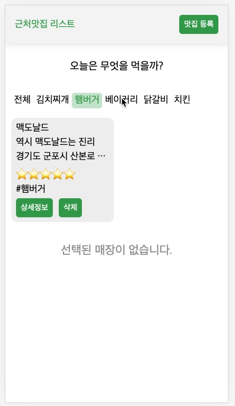
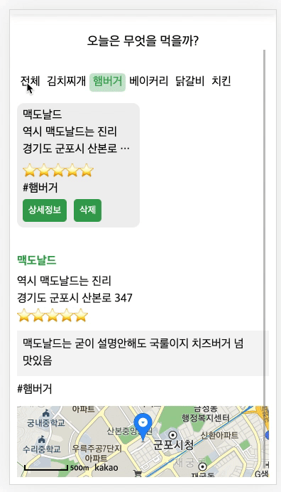

# 근처 맛집을 기록하는 웹앱

항상 느끼는 거지만 우리집 근처에는 맛집이 많이 없는거같다.
통상 6곳정도 배달주문을 하면 한곳정도는 괜찮은 정도랄까?
그래서 앞으로의 맛집에 대한 기록을 위해 음식의 카테고리 별로 기록을 할 수 있는
저장 웹앱을 만들어보려한다.

## 필요한 기능 기획리스트

- [x] 맛있었던 식당에 대한 정보를 기록(저장)할 수 있는 기록칸
- [x] 기록된 식당의 정보를 카테고리별로 뷴류하여 볼 수 있는 리스트 페이지
- [x] 선택된 식당의 상세정보를 볼 수 있는 디테일 페이지

## fix update

- [x] 등록취소된 데이터 처리 및 등록 후 데이터 바로 보이게 하기
- [x] 저장된 데이터 삭제 기능

## 폴더트리 구성

```
├── components
│ ├── shared
├── context
```

## 제작환경 라이브러리

1. swiper : 식당의 리스트를 캐로셀형식으로 표현하기 위함
2. eslint, prettier : 코드 가독성 및 에러방지
3. scss, classnames : css 라이브러리 및 활용도를 올리기 위한 classnames

## DB 구상

초기 로컬 스토리지로 구성할 예정이었으나 혹시나 모를 날아감에 대비하여
좀더 안전한 firebase의 DB를 이용할 예정

## 단계별 정리

### 컴포넌트 구성

- Header : 헤더 구성 컴포넌트
- Write : 맛집 등록 컴포넌트
- Items : 등록된 맛집들의 정보를 랜더링하는 컴포넌트
- Category : 맛집들의 카테고리별로 확인할 수 있는 컴포넌트
- Detail : Items에서 선택된 맛집의 상세정보를 확인하는 컴포넌트
- Map : Detail에서 받은 주소를 전달하여 카카오 지도 로드 컴포넌트

### 맛집 등록

단순하게 맛집기록용으로 사용할 목적이기에 처음에는 로컬스토리지로 데이터를 저장하려했으나
좀더 안전한 DB용으로 파이어베이스를 활용하였습니다.
add형식이 아닌 set형식을 사용하여 매점이름을 id값으로 전달하였습니다. <br />


### 등록된 맛집 불러오기

파이어베이스 레스토랑 콜렌션에 기록된 매장정보들을 불러와 스와이퍼 라이브러리와 함께 불러왔습니다.
불러옴과 동시에 매점정보들은 context에 전달하여 복잡한 상태관리를 단순하게 구현하였습니다.

### 선택된 카테고리 맛집리스트 불러오기

전체 매점리스트에서 중복되지않은 카테고리값을 filter로 재배열하여
랜더링하였습니다. 이후 선택된 innerText값을 매장 id와 비교하여 동일한 키워드의 데이터를 읽어왔습니다.

이부분에서 계속 로컬에서와 배포했을 때 구동이 다른 처음겪는 에러로인하여 시간이 소요되었습니다.
알고보니 sort함수의 사용이 적절하지 못하였던 부분인걸 발견하고 에러에 대한부분을 수정하였습니다. <br />


### 상세정보 클릭시 상세정보 랜더링

Items에서 선택된 데이터의 title값을 전달받아 콜렉션의 id === title과 비교하여 같은 데이터의 상세정보를
읽었습니다.

또한 저장된 주소의 정보를 기반으로 카카오 지도 api를 연결하여 매점의 위치를 표기하였습니다. <br />


### 삭제기능

파이어 베이스에서 제공해주는 deleteDoc 함수를 사용하여 디테일 정보를 불러오는 것과 같은 방식의
id === title의 비교로 데이터를 찾은 후 삭제 하였습니다. <br />


## 회고록

노드를 업데이트하면서 생긴 에러이슈등으로 제법 새로운 버그를 픽스하는 부분에 시간이 걸린거같습니다.
리엑트 5.0.0으로 진행시 react-error-overlay에 대한 이슈라던지
eslint 호환성부분도 문제가 있어 cra 레포에 정보의 도움이 컸습니다.

또한 배열 sort함수가 로컬에서와 배포에서 성능적인 차이가 있는부분도 새롭게 알게된것 같습니다.
sort함수의 원리를 좀더 자세히 알 필요성을 느끼면서
블로그 메모메모를 해야겠습니다.

(앞으로 맛집기록해두면서 별로였던 가게는 주문하지 않도록 주의)
